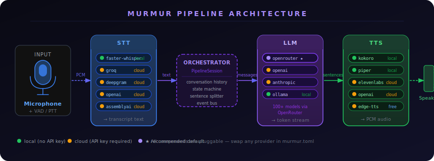

<div align="center">
  
  <br/><br/>
  
  &nbsp;
  
  &nbsp;
  
  &nbsp;
  
  <br/><br/>
  <strong>Local-first agentic voice pipeline.</strong><br/>
  STT → LLM → TTS. Every major provider. Swap anything in one config line.
</div>

---

## What is Murmur?

Murmur is an open-source voice AI pipeline that connects speech recognition, language model inference, and speech synthesis into a single streaming loop. It runs entirely on your machine by default — no data leaves your device unless you choose a cloud provider.

```
Microphone → [STT] → text → [LLM] → tokens → [TTS] → Speaker
```

Sentence-boundary buffering means TTS starts speaking the first sentence while the LLM is still generating the second. Perceived latency: **under 1 second** on modern hardware.

---

## Architecture



---

## Quickstart

```bash
# Install (local providers — no API keys needed for STT + TTS)
pip install murmur-voice[faster-whisper,kokoro]

# Get a free OpenRouter key (for LLM)
# https://openrouter.ai/keys

export OPENROUTER_API_KEY=sk-or-...

# Run
murmur run
```

First run downloads the Whisper `base.en` model (~145MB). Subsequent runs are instant.

### Docker (one-liner)

```bash
docker run -it --rm \
  -e OPENROUTER_API_KEY=sk-or-... \
  --device /dev/snd \
  ghcr.io/murmur-voice/murmur:latest
```

---

## Provider Matrix

### STT (Speech-to-Text)

| Provider | Local | API Key | Quality | Latency | Install |
|---|:---:|:---:|---|---|---|
| **faster-whisper** ⭐ | ✓ | ✗ | Good | ~500ms | `[faster-whisper]` |
| groq | ✗ | ✓ | Excellent | ~200ms | core |
| deepgram | ✗ | ✓ | Excellent | ~150ms | `[deepgram]` |
| openai | ✗ | ✓ | Excellent | ~800ms | core |
| assemblyai | ✗ | ✓ | Excellent | ~1s | `[assemblyai]` |

### LLM

| Provider | Local | API Key | Notes |
|---|:---:|:---:|---|
| **openrouter** ⭐ | ✗ | ✓ | 100+ models, free tier available |
| openai | ✗ | ✓ | GPT-4o, GPT-4o-mini |
| anthropic | ✗ | ✓ | Claude 3.5 Sonnet, Haiku |
| ollama | ✓ | ✗ | Any GGUF model locally |

### TTS (Text-to-Speech)

| Provider | Local | API Key | Quality | Install |
|---|:---:|:---:|---|---|
| **kokoro** ⭐ | ✓ | ✗ | High | `[kokoro]` |
| piper | ✓ | ✗ | Good | `[piper]` |
| edge-tts | ✗ | ✗ | Good | `[edge-tts]` (free!) |
| elevenlabs | ✗ | ✓ | Best | `[elevenlabs]` |
| openai | ✗ | ✓ | High | core |
| cartesia | ✗ | ✓ | High | `[cartesia]` |

⭐ = recommended default

---

## Configuration

```bash
murmur init          # create murmur.toml with local preset
murmur init --preset cloud   # create with cloud providers
```

### murmur.toml

```toml
[pipeline]
mode = "push-to-talk"   # or "vad"

[stt]
provider = "faster-whisper"
[stt.config]
model = "base.en"   # tiny.en | base.en | small | medium | large-v3

[llm]
provider = "openrouter"
model = "mistralai/mistral-7b-instruct:free"
system_prompt = "You are a helpful voice assistant. Be concise."
[llm.config]
fallback_model = "google/gemma-2-9b-it:free"

[tts]
provider = "kokoro"
voice = "af_sarah"
speed = 1.0
```

All providers can also be set via environment variables:

```bash
export MURMUR_STT_PROVIDER=groq
export MURMUR_LLM_MODEL=anthropic/claude-3-haiku
export MURMUR_TTS_PROVIDER=elevenlabs
```

---

## CLI Reference

```bash
murmur run                        # start voice pipeline
murmur run --stt groq --tts edge-tts   # override providers
murmur run --model openai/gpt-4o  # override model
murmur run --dry-run              # mock providers, no hardware needed

murmur chat                       # text chat (no mic)
murmur chat --no-tts              # text-only, skip audio

murmur providers                  # list all providers
murmur providers --type stt       # filter by type
murmur models                     # show OpenRouter model recommendations
murmur models --tier free         # free models only
murmur devices                    # list audio devices
murmur init                       # create config file
```

---

## Python API

```python
import asyncio
from murmur import MurmurConfig, PipelineSession

async def main():
    cfg = MurmurConfig.load("murmur.toml")

    async with PipelineSession(cfg) as session:
        # Text chat
        response = await session.process_text("What's the weather like?")

        # Or process raw audio bytes
        with open("audio.wav", "rb") as f:
            audio = f.read()
        response = await session.process_audio(audio)

        # Subscribe to events
        from murmur.events import Events
        async def on_transcript(event):
            print(f"Heard: {event.data}")
        session.bus.on(Events.TRANSCRIPT, on_transcript)

asyncio.run(main())
```

---

## OpenRouter Setup

OpenRouter is the recommended LLM provider — one API key unlocks 100+ models including free ones.

1. Sign up at **https://openrouter.ai/keys** (no credit card for free models)
2. `export OPENROUTER_API_KEY=sk-or-...`
3. Pick a model: `murmur run --model mistralai/mistral-7b-instruct:free`

**Free models** (no credits needed):
- `mistralai/mistral-7b-instruct:free`
- `meta-llama/llama-3.1-8b-instruct:free`
- `google/gemma-2-9b-it:free`

**For production**, add a fallback model:
```toml
[llm.config]
fallback_model = "mistralai/mistral-7b-instruct:free"
```

---

## Install Options

```bash
pip install murmur-voice                        # core only
pip install murmur-voice[faster-whisper,kokoro] # recommended local setup
pip install murmur-voice[local]                 # all local providers
pip install murmur-voice[cloud]                 # all cloud providers
pip install murmur-voice[all]                   # everything
```

---

## Contributing

See [CONTRIBUTING.md](CONTRIBUTING.md). The fastest way to contribute is adding a new provider — each one is a single file implementing a simple ABC.

```bash
git clone https://github.com/murmur-voice/murmur
cd murmur
uv sync --dev
uv run pre-commit install
uv run pytest tests/unit/
```

---

## License

Apache 2.0 — see [LICENSE](LICENSE).
